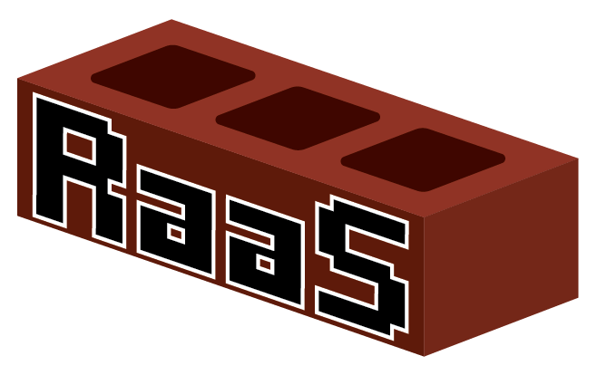
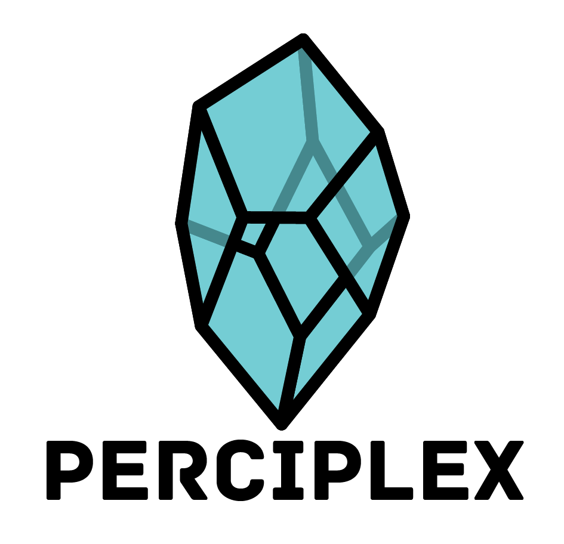
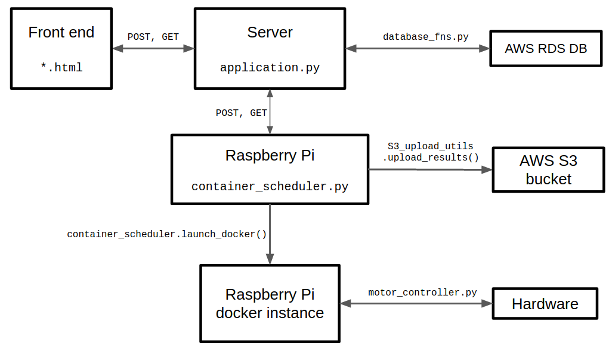

# RaaS

 
 

 

Reality as a Service (RaaS) is an open source platform for hosting physical OpenAI Gym environments. This lowers the barrier to transitioning to real robots in both effort and cost, allows the outsourcing of maintenance of robots to specialists, amortized cost of robots over more researchers and RL practitioners, and less useless down-time for expensive robots.

The user submits a GitHub repo to a web based front end. The queue is queried by robot instances, which then gives the user an allotted amount of time. The results of this run are then returned to the user.

The robot is controlled via a gym environment to be found [here](https://github.com/perciplex/raas-envs). It is designed to be a simple drop-in replacement for the usual OpenAI gym, having the same API as the corresponding OpenAI gym environment.

Try it out here! [raas.perciplex.com](http://raas.perciplex.com).

## System architecture

The bulk of the system is done by two files: the server, (`application.py`), and the RPi's constantly running script (`container_scheduler.py`). They communicate with each other via `POST` and `GET` requests.

The server handles the front end to get new submitted jobs and report on the status of submitted jobs. It also talks to an AWS RDS database to manage all the jobs.

The RPi runs a `systemd` service that runs the `container_scheduler.py` script. This script repeatedly polls the server to see if there are any new jobs to be done. If there are, it calls `launch_docker()`, which launches a docker to run the user's code. The result of the run is then sent off to an AWS S3 bucket, and the RPi tells the server it has completed.

### Folder Summary

- `raas_gym` - Library that replicates OpenAI gym interface for both simulation testing and for running on physical hardware. This is the client facing code to be imported in python
- `server/` - Server side application for accepting new jobs, maintaining job queue, and returning data to web frontend.
- `hardware/` - contains bill of materials and instructions for constructing pendulum. Also contains python motor driver code.
- `docker_driver/` - Responsible for polling server, getting the repo, and cloning into docker image and running.
