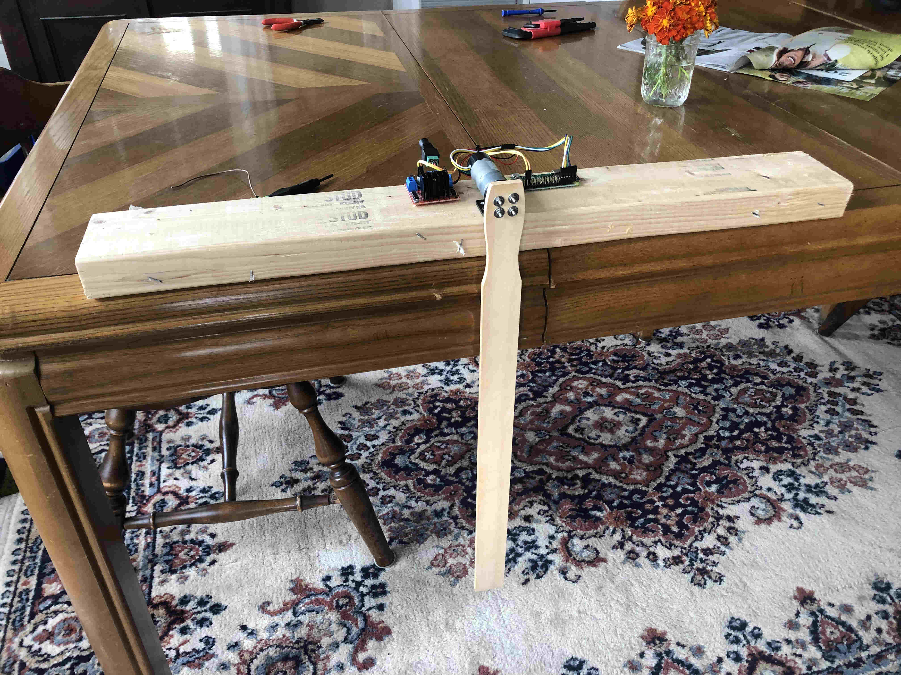
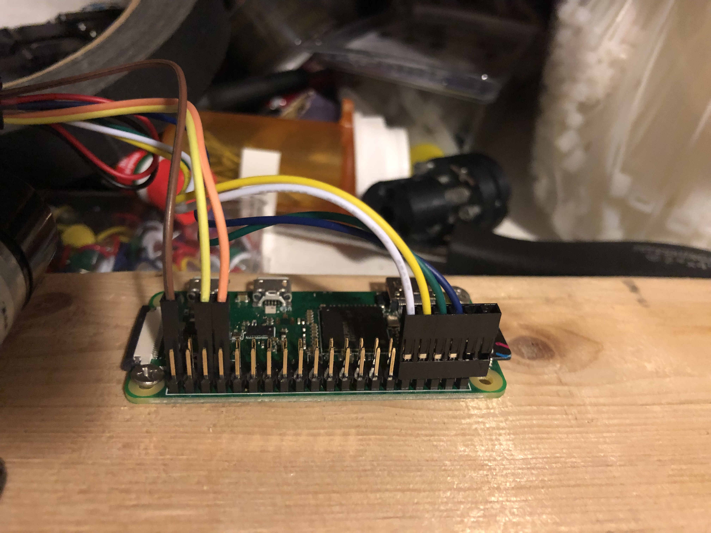
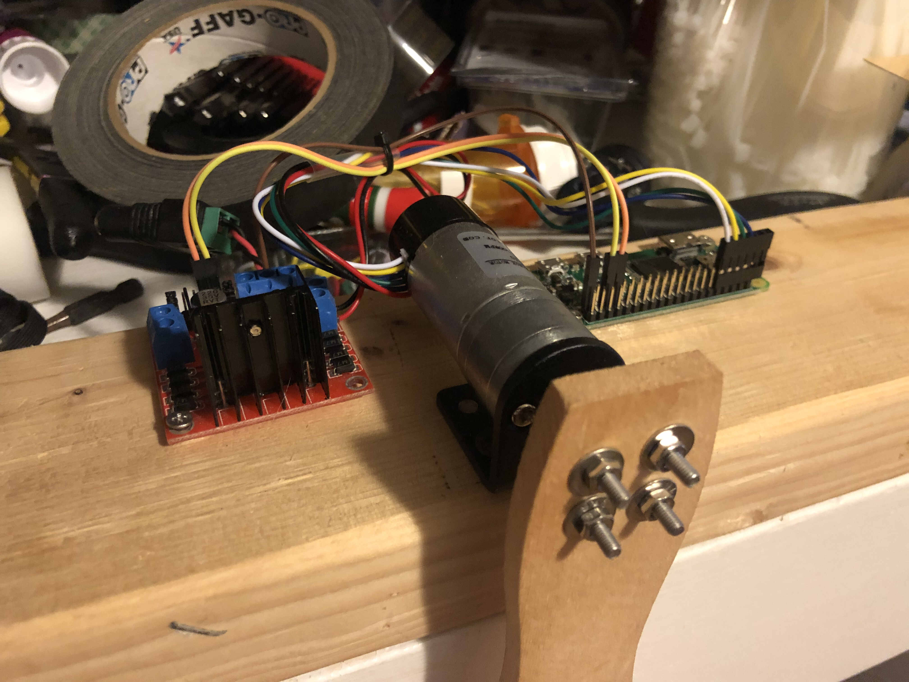
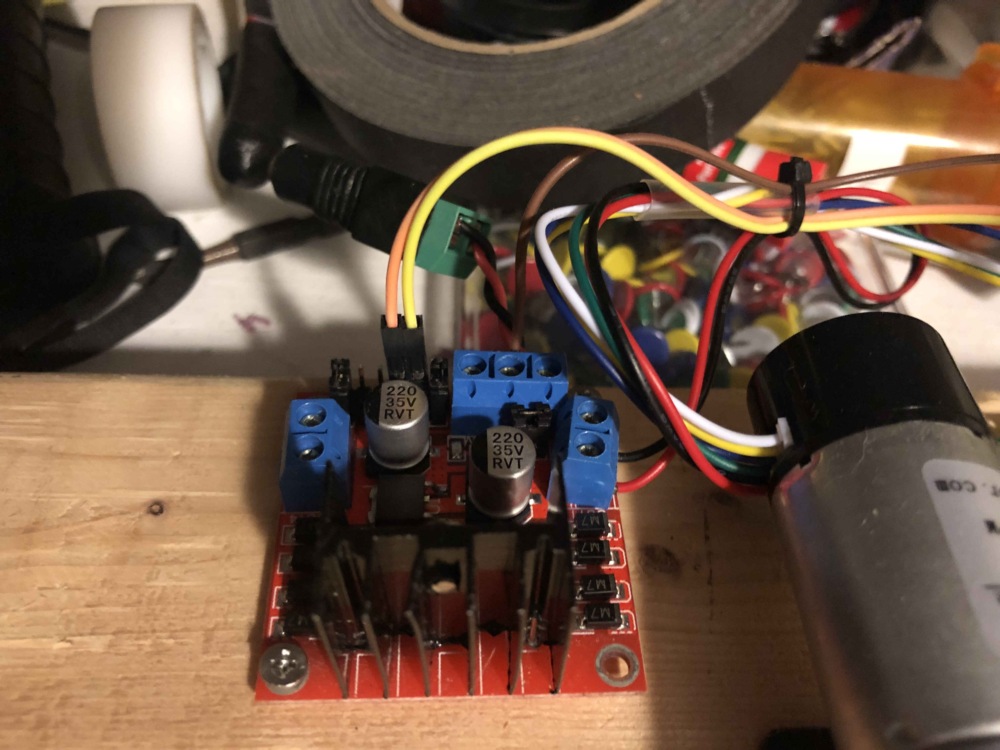
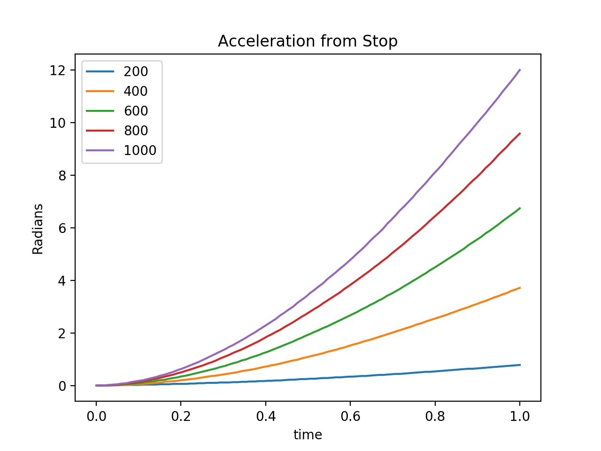

# Pendulum Hardware

The pendulum is built using easily available hardware. The following are instructions for purchase and assembly.

## Bill of Materials

- Raspberry Pi (We use a Pi Zero W)
  + Power Supply for Pi
  + SD card for Pi
- L298N Motor Driver Board.
- Ribbon cable
- Gearbox Motor with built in encoder. 12V 600 RPM
- 12V Power Supply
- Power supply female donkus plug. DC Power Jack Plug adapter
- Wire
- Paint Stirrer Rod. Only the best for us!
- Mounting 2x4
- 4mm Flange Shaft Coupling
- 25mm DC Gearbox Motor Bracket
- 4x m3 12mm nuts and boltd
- Mounting nuts 

Amazon shopping cart link : https://www.amazon.com/ideas/amzn1.account.AHWUEKBOXRZZ2YOBITVMXOZ7P2XA/2R26EST3LRFIO

## Pi Setup

https://www.raspberrypi.org/help/

Tips:

- We use Raspbian lite edition
- Using a monitor and keyboard will make it easier
- Plugging into ethernet as compared to wifi will be easier.

## Pendulum Construction

## Hooking the Pi up to the Pendulum

We remove the black and red wire from the motor plug and swap the blue and green wire Then the plug can fit right on Pi pins. The yellow and white encoder wires are then connectedt to pins 14 and 15. And the Blue wire is connectedt o 5V and the green wire to ground.

The Pi needs to be connected to 2 channels of the motor driver for forward and backward.
The encoder requires 4 wires.

"Hardware PWM available on GPIO12, GPIO13, GPIO18, GPIO19"
So we should probably use one of those for motor control.
Connect the control pins for the l298n board to pins 13 and 19.

https://www.raspberrypi.org/documentation/usage/gpio/README.md

https://www.raspberrypi.org/documentation/usage/gpio/images/gpio-numbers-pi2.png

L298N Datasheet
https://www.sparkfun.com/datasheets/Robotics/L298_H_Bridge.pdf

## Pi setup

The base image has like barely anything in it

sudo apt-get install python3-pip git pigpiod

pip3 install -r ./requirements.txt 

sudo pigpiod
pigpiod can take sampling time as a parameter. Does that help not miss steps?

http://abyz.me.uk/rpi/pigpio/python.html

https://github.com/pootle/pimotors

## Calibration

Calibration programs and procedure.

The motor has interesting control charactersitics. By fitting measured data to a motor model, we can account for these dynamics. 

It is also possible to just get a machine learned approach to work on an uncalibrated system.

We turned the pendulum on its side and ran a sequence of commands starting from a stopped position. We fit a quadratic polynomial to these values to get an acceleration per command

Fitting a line to the gave

angular_accel = 0.01223 * command

Then we allow the pendulum to freely swing and fit a damped oscillation to this.

omega = 5.28 => f = 1.6806761990504149 Hz => 0.5950008032510844 s period
0.38 decay constant

For near the bottom of the oscillation, a pendulum swings with omega = sqrt(g/L)

The equations of motion of a pendulum is

alpha = - omega^2 sin(theta) + a_ext

      = - omega^2 sin(theta) + 0.01223 * command

### Motor Data

✔Product type: DC Gear motor with two-channel Hall effect encoder;Rated Voltage: 12V; No-Load Speed: 150RPM; No-Load Current: ≤ 0.15A;Rated Torque: 0.95kg.cm;

✔Main Body Dimensions:74.8 x 25mm / 2.95in x 0.99in (L*D); Out Shaft Dimensions: 11 x 4mm / 0.433 x 0.1575in (L*D) with 10 x 0.5mm / 0.39 * 0.017inches flat cut off;

✔Single Output 408 Pulses Per Revolution: Gear Reduction Ratio: 1/34, Each Loop Output Pulses: 12PPR 34*12=408PPR;

✔Wiring Diagram: Red - Motor power terminal (+);Black - Motor power terminal(-);Green - Quad encoder Ground;Blue - Quad encoder +5V Vcc;Yellow - Quad encoder A signal;White - Quad encoder B signal;